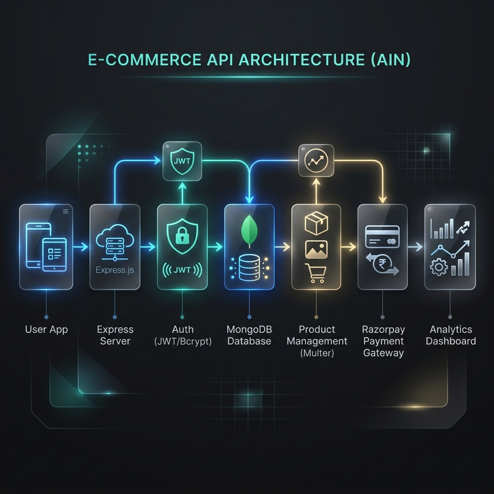

# 🛒 Ain - Scalable E-Commerce API

[](https://nodejs.org/)
[](https://expressjs.com/)
[](https://www.mongodb.com/)
[](https://razorpay.com/)
[](https://jwt.io/)

**Ain** is a high-performance, feature-rich backend API for modern e-commerce platforms. Built with a focus on scalability and security, it provides a robust foundation for handling everything from user authentication and real-time inventory to secure payments and deep sales analytics.

---

## 🏗️ System Architecture & Data Flow

Below is a visual representation of how data flows through the **Ain** ecosystem—from user interaction to payment finalization and analytics generation.



---

## 🚀 Key Features

### 🔐 Security & Identity
- **Stateless Authentication**: Powered by **JSON Web Tokens (JWT)** for secure, scalable session management.
- **Advanced Hashing**: Industry-standard password protection using **Bcrypt**.
- **Role-Based Access**: Granular protection middleware for administrative and user-specific actions.

### 📦 Product & Inventory
- **Smart Catalog**: Full CRUD operations with support for complex querying, filtering, and pagination.
- **Rich Media**: Integrated **Multer** support for multiple high-resolution image uploads (up to 5 per product).
- **Dynamic Search**: Regex-powered search for finding products across names and descriptions.

### 🛒 Commerce Engine
- **Persistent Carts**: User-linked shopping carts that persist across sessions.
- **Order Lifecycle**: Automated order creation, status tracking, and history management.
- **Payment Gateway**: Seamless **Razorpay** integration with secure order creation and webhook-driven verification.

### 📊 Business Intelligence
- **Aggregation Engine**: Real-time sales analytics using MongoDB's powerful aggregation pipelines.
- **Revenue Insights**: Tracking revenue by category, daily sales trends (30-day window), and top-performing products.

---

## 🛠️ Technology Stack

- **Runtime**: Node.js (v18+)
- **Framework**: Express.js
- **Database**: MongoDB (Mongoose ODM)
- **Payments**: Razorpay Node SDK
- **Processing**: Multer (File Handling), Bcrypt (Security)
- **Environment**: Dotenv (Config management)

---

## 📂 Project Structure

```text
ain/
├── assets/             # Project brand assets & flow diagrams
├── config/             # Database connection & third-party configs
├── controllers/        # Core business logic (Auth, Products, Orders, etc.)
├── middleware/         # Security guards, file uploaders, and error handlers
├── models/             # Mongoose schemas (User, Product, Cart, Order)
├── routes/             # API entry points & endpoint definitions
├── uploads/            # Secure local storage for product media
├── utils/              # Functional helpers and utility classes
├── server.js           # Application entry point
└── .env                # Environment configuration
```

---

## 🚦 API Reference

### 🔐 Authentication
| Method | Endpoint | Description |
| :--- | :--- | :--- |
| `POST` | `/api/auth/register` | Register a new account |
| `POST` | `/api/auth/login` | Authenticate & receive JWT |

### 📦 Products
| Method | Endpoint | Description |
| :--- | :--- | :--- |
| `GET` | `/api/products` | Paginated product list with filters |
| `GET` | `/api/products/:id` | Fetch detailed product info |
| `POST` | `/api/products` | Create product (supports multi-image upload) |
| `PUT` | `/api/products/:id` | Update product details |
| `DELETE` | `/api/products/:id` | Soft-delete/Remove product |

### 🛒 Shopping Cart
| Method | Endpoint | Description |
| :--- | :--- | :--- |
| `GET` | `/api/cart` | Retrieve personal cart |
| `POST` | `/api/cart` | Add/Update items in cart |
| `DELETE` | `/api/cart/:id` | Remove specific item |

### 💳 Payments & Orders
| Method | Endpoint | Description |
| :--- | :--- | :--- |
| `POST` | `/api/payment/create-order` | Initialize Razorpay payment session |
| `POST` | `/api/payment/webhook` | Securely verify payment status |
| `GET` | `/api/orders/user` | View personal order history |

### 📈 Business Analytics (Admin)
| Method | Endpoint | Description |
| :--- | :--- | :--- |
| `GET` | `/api/analytics/summary` | Global sales & revenue overview |
| `GET` | `/api/analytics/category` | Revenue breakdown by product category |
| `GET` | `/api/analytics/top-products`| Identify highest grossing items |

---

## ⚙️ Installation & Setup

1. **Clone & Install**:
   ```bash
   git clone [your-repo-link]
   cd ain
   npm install
   ```

2. **Environment Configuration**:
   Create a `.env` file with the following variables:
   ```env
   # General
   PORT=5000
   NODE_ENV=development

   # Database
   MONGO_URL=your_mongodb_connection_string

   # Security
   JWT_SECRET=your_jwt_signing_secret

   # Payments
   RAZORPAY_KEY_ID=your_razorpay_key
   RAZORPAY_KEY_SECRET=your_razorpay_secret
   RAZORPAY_WEBHOOK_SECRET=your_webhook_secret
   ```

3. **Run the Application**:
   ```bash
   # Development Mode
   npm run dev

   # Production Mode
   npm start
   ```

---

## 🛡️ License

Distributed under the ISC License. See `LICENSE` for more information.

---

<p align="center">
  Generated with ❤️ for the E-commerce Developer Community
</p>
