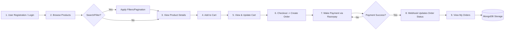

# 🛒 Ain - Advanced Scalable E-Commerce API

[](https://nodejs.org/)
[](https://expressjs.com/)
[](https://www.mongodb.com/)
[](https://razorpay.com/)
[](https://jwt.io/)

Welcome to **Ain**, a comprehensive and high-performance backend solution for modern e-commerce ecosystems. This API is engineered for reliability, featuring secure payment integrations, deep business analytics, and a user-centric flow designed for seamless shopping experiences.

---

## 🚦 Normal User Flow - Step-by-Step

The following diagram illustrates the typical customer journey from onboarding to post-purchase review.



---

## 💡 Key Learnings

During the development of this scalable architecture, several core engineering principles were mastered:

- **State Management & Stateless Auth**: Implemented **JWT (JSON Web Tokens)** to maintain secure user sessions without storing them in memory, ensuring the API can scale across multiple server instances.
- **Event-Driven Payment Logic**: Learned the critical importance of **Webhooks**. Moving beyond simple status checks, I implemented a robust webhook handler that asynchronously updates order status and inventory only after Razorpay verifies the transaction.
- **Performance-Oriented Querying**: Leveraged **MongoDB Aggregation Pipelines** to replace multiple database calls with single, optimized operations—especially for the Analytics dashboard where revenue and top products are calculated on-the-fly.
- **Scalable Folder Structure**: Adopted the **MVC (Model-View-Controller)** design pattern with a clear separation of concerns (Routes -> Middleware -> Controllers -> Models), which significantly simplified debugging and feature expansion.

---

## 🚧 Challenges Faced

Building a production-ready API presented several complex hurdles that required creative technical solutions:

1. **Managing Concurrent Image Uploads**: 
   - *The Challenge*: Handling multiple high-resolution images simultaneously using **Multer** without blocking the event loop or running into storage limits.
   - *The Solution*: Implemented a custom storage engine with unique filename suffixing and validation filters to ensure consistent file metadata in the database.

2. **Ensuring Transaction Integrity**:
   - *The Challenge*: Ensuring that an order is only marked as "Paid" when the payment gateway actually confirms it, preventing "ghost orders" where users checkout but payments fail mid-way.
   - *The Solution*: Decoupled the **Order Creation** from the **Payment Success**. Order is created with a `pending` status, and only the secure **Razorpay Webhook** triggers the transition to `paid`.

3. **Complex Business Intelligence Logic**:
   - *The Challenge*: Caluating revenue by category and identifying "Top Products" required joining multiple collections (`Orders` and `Products`) while filtering only successful transactions.
   - *The Solution*: Designed deep nested aggregation pipelines using `$unwind`, `$lookup`, and `$group` to process thousands of data points efficiently within the database layer.

---

## 🛠️ Technical Deep-Dive

### 🔐 Authentication Strategy
Authorization is handled via a custom `protect` middleware. 
- It extracts the Bearer token from headers.
- Decodes the payload and identifies the user ID.
- Attaches the `user` object to the request, enabling granular access control for Cart and Order management.

### 💳 Payment & Ordering Handshake
1. **Frontend** initiates payment request.
2. **Backend** creates a `Razorpay Order Instance` and stores it with a local `pending` order.
3. **Razorpay Webhook** (Secure with HMAC verification) validates the secret and updates the MongoDB document status to `paid`.

### 📂 API Reference (Detailed)

#### 🔐 Auth
- `POST /api/auth/register`: 
  ```json
  { "name": "John", "email": "john@example.com", "password": "securepassword" }
  ```
- `POST /api/auth/login`: Returns `{ token: "jwt_string", user: { ... } }`

#### 📦 Products
- `GET /api/products`: Supports query params `?keyword=...&category=...&minPrice=0&page=1`
- `POST /api/products`: (Multipart/Form-Data) Allows up to 5 images.

#### 🛒 Cart & Orders
- `POST /api/cart`: Add or update items.
- `POST /api/payment/create-order`: Initializes the Razorpay session.

---

## ⚙️ Installation & Setup

1. **Environment Config**:
   Rename `.env.example` to `.env` and provide your **MongoDB URI**, **JWT Secret**, and **Razorpay Credentials**.
2. **Commands**:
   ```bash
   npm install
   npm run dev
   ```

---


